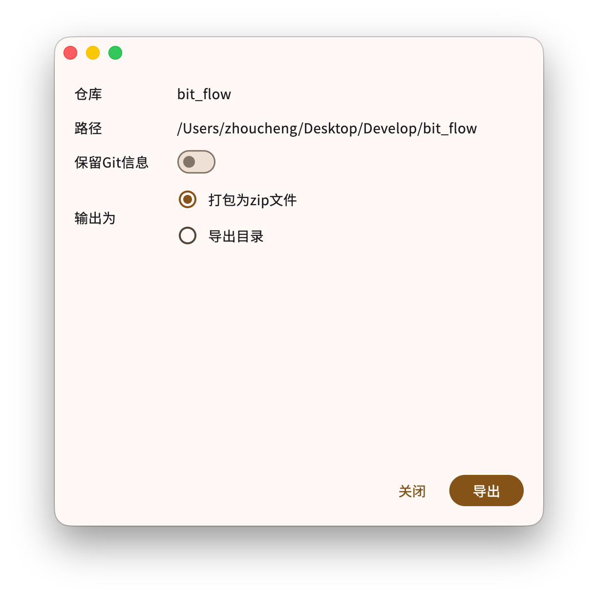

# GitPack

一个通过Git仓库的`.gitignore`精简仓库文件导出zip压缩包或者文件夹，支持macOS & Windows

核心组件库[在这里](https://github.com/Zhoucheng133/GitPack-Core)

> [!NOTE]
> 不支持嵌套`.gitignore`配置，只会根据项目根目录的`.gitignore`文件判断需要忽略哪些文件

## 截图

